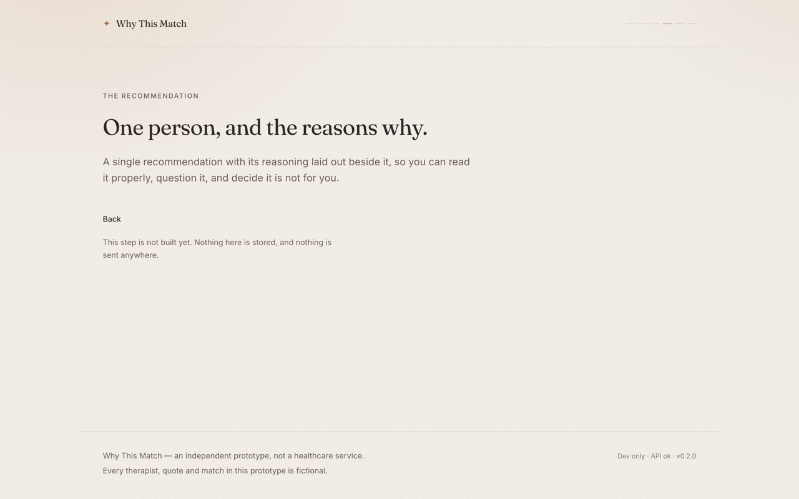

# Why This Match

> How can therapist matching be made more transparent without turning therapy into a
> therapist-shopping experience?

**Why This Match** is an independent portfolio prototype. The product it points towards would let
someone describe what they are looking for in their own words, have those preferences structured,
be matched with a therapist, **understand why that therapist was recommended**, say so when it does
not feel right, and receive a rematch based on that feedback.

> **This is not a Mindbun product.** It is an independent prototype and is not affiliated with,
> endorsed by, or connected to Mindbun or any healthcare provider. No logos, illustrations, or
> marketing material have been reproduced. Every therapist, quote, and match that appears in this
> prototype is **synthetic** — invented for demonstration and not a real person.

| Landing                                               | Start                                             | A journey step                                                   |
| ----------------------------------------------------- | ------------------------------------------------- | ---------------------------------------------------------------- |
|  |  |  |

---

## Current phase

**Phase 1 — Foundation + visual design system.** Complete.
**Phase 2 — Application shell + frontend/backend contract.** Complete.

Delivered so far:

- npm-workspace monorepo: `apps/web` (React) and `apps/api` (Fastify).
- A complete, tokenised design system: warm palette, editorial type scale, spacing rhythm, radii,
  shadows, and motion — all in one stylesheet, all contrast-checked.
- An application shell with a journey-aware header, a position indicator, and route transitions
  that no longer destroy page state.
- Seven routes: `/` and `/start` implemented; `/intake`, `/matching`, `/recommendation`,
  `/feedback` and `/rematch` present as intentional placeholders for the flow to come.
- A typed API client (`src/lib/api`) with timeouts, cancellation, typed errors, and reusable
  loading and error states in the product's own voice.
- A versioned backend API under `/api/v1`, with Fastify response schemas, CORS, and the
  infrastructure probe at `/health` kept intact.
- Tests, strict TypeScript, ESLint (type-aware + jsx-a11y), Prettier, and written documentation.

Deliberately **not** built yet: the intake form, preference structuring, matching, recommendation
explanation, feedback and rematch behaviour, persistence, authentication, and any AI service.

## Tech stack

| Layer    | Choice                                                                   |
| -------- | ------------------------------------------------------------------------ |
| Frontend | React 19, TypeScript, Vite 8, React Router 8, Tailwind CSS 4 (CSS-first) |
| Backend  | Node.js 24, TypeScript, Fastify 5, `@fastify/cors`                       |
| Testing  | Vitest 5, Testing Library, `@testing-library/jest-dom`, Fastify `inject` |
| Tooling  | ESLint 9 (flat config, type-aware), Prettier 3, npm workspaces           |

No database, no ORM, no auth, no AI APIs, no Next.js, no Python — by design, per the phase brief.

## Requirements

- Node.js **>= 22.12** (developed on 24.7)
- npm 10+

## Getting started

```bash
npm install
npm run dev        # web on http://localhost:5173, api on http://127.0.0.1:4000
```

`npm run dev` starts both apps together (via `concurrently`).

| Command               | What it does                                                    |
| --------------------- | --------------------------------------------------------------- |
| `npm run dev`         | Runs web and api together                                       |
| `npm run dev:web`     | **Frontend** dev server (Vite), http://localhost:5173           |
| `npm run dev:api`     | **Backend** dev server (Fastify via tsx), http://127.0.0.1:4000 |
| `npm run build`       | Type-checks and builds both workspaces                          |
| `npm run preview:web` | Serves the production web build locally                         |
| `npm test`            | Runs every test in both workspaces                              |
| `npm run typecheck`   | `tsc --noEmit` for both workspaces                              |
| `npm run lint`        | ESLint across the repo (`lint:fix` to autofix)                  |
| `npm run format`      | Prettier write (`format:check` to verify)                       |
| `npm run check`       | typecheck → lint → format:check → test, in one go               |

> If you add a dependency, prefer editing `package.json` and running `npm install`, rather than
> `npm install <pkg>`. Incremental installs have been observed to drop esbuild's platform-specific
> optional binary from the lockfile on this machine, which breaks the API's `tsx` dev server. A
> clean `rm -rf node_modules package-lock.json && npm install` restores it.

## API architecture

```
Browser (React)
  └─ lib/api client          typed, one place that knows about fetch
      └─ HTTP (+ CORS)       VITE_API_URL
          └─ Fastify
              ├─ /health            infrastructure liveness (unversioned, no CORS)
              └─ /api/v1/…           the versioned application API
                  └─ future domains  intake, matching, recommendation, feedback
```

The request path, end to end:

```
/api/v1/health  →  200
{
  "status": "ok",
  "service": "why-this-match-api",
  "version": "0.2.0",
  "timestamp": "2026-09-28T10:00:00.000Z"
}
```

```bash
curl http://127.0.0.1:4000/api/v1/health
```

- `/api/v1` is the application namespace. Future domains register inside
  `apps/api/src/api/v1/routes/`, and a future `/api/v2` can sit beside it without touching v1.
- Every response is declared as a JSON Schema that Fastify validates and serialises from; the
  matching TypeScript interface lives in `apps/api/src/api/v1/schemas/`, and the client mirrors it in
  `apps/web/src/lib/api/types.ts`.
- `/health` is kept separate on purpose: it is cheap, version-free liveness for infrastructure, and
  the client never calls it.

## Environment configuration

Copy `.env.example` to `.env` at the repo root. Every value has a safe default, so `.env` is
optional.

| Variable              | Default                                          | Applies to | Purpose                         |
| --------------------- | ------------------------------------------------ | ---------- | ------------------------------- |
| `NODE_ENV`            | `development`                                    | api        | Runtime mode                    |
| `API_HOST`            | `127.0.0.1`                                      | api        | Bind address                    |
| `API_PORT`            | `4000`                                           | api        | Bind port                       |
| `API_LOG_LEVEL`       | `info`                                           | api        | Pino log level                  |
| `API_CORS_ORIGIN`     | `http://localhost:5173,http://127.0.0.1:5173`    | api        | Browser origins allowed to call |
| `VITE_API_URL`        | `http://127.0.0.1:4000` in dev, unset in a build | web        | API base URL                    |
| `VITE_API_TIMEOUT_MS` | `8000`                                           | web        | Per-request timeout             |

Only `VITE_`-prefixed variables reach the browser bundle. In a production build an unset
`VITE_API_URL` is not silently ignored: the client refuses to make a request and reports a
configuration error rather than failing mysteriously.

## Project structure

```
.
├── apps/
│   ├── api/                  Fastify service
│   │   ├── src/
│   │   │   ├── api/v1/       the versioned application API
│   │   │   │   ├── routes/   one module per endpoint, test beside it
│   │   │   │   └── schemas/  JSON Schema + TypeScript interface per response
│   │   │   ├── routes/       unversioned infrastructure routes (/health)
│   │   │   ├── config/env.ts environment reading and validation
│   │   │   ├── app.ts        buildApp(): instance, CORS, route registration
│   │   │   └── server.ts     process entry: config, listen, shutdown
│   │   └── tsconfig.build.json
│   └── web/                  React client
│       ├── public/fonts/     self-hosted Fraunces + Inter (OFL 1.1)
│       └── src/
│           ├── app/          application bootstrap (App)
│           ├── components/   presentational building blocks
│           ├── layouts/      shared page frame (SiteLayout)
│           ├── lib/          framework-free helpers
│           │   └── api/      config, client, errors, typed endpoints
│           ├── pages/        one component per route
│           ├── routes/       paths, journey, route tree, browser router
│           ├── styles/       design tokens + base layer
│           └── test/         test setup and render helpers
├── docs/
│   ├── architecture.md         the whole system, and why
│   ├── frontend-architecture.md routing, state boundaries, API client
│   ├── design-system.md        the visual language
│   └── screenshots/
├── .env.example
└── package.json              npm workspaces root
```

## Documentation

- [`docs/frontend-architecture.md`](docs/frontend-architecture.md) — routing, layouts, the API
  client, and where state is allowed to live.
- [`docs/architecture.md`](docs/architecture.md) — repository shape, backend, the request path,
  testing strategy, and the seams Phase 3 will plug into.
- [`docs/design-system.md`](docs/design-system.md) — philosophy, tokens, components, motion,
  accessibility rules.

## Accessibility

Verified in a real browser, not assumed:

- Semantic landmarks (`header`/`main`/`footer`), one `h1` per route, ordered headings, checked on
  every route by an automated test.
- Visible focus ring on every interactive element (2px clay outline, 3px offset), and a skip link
  as the first tab stop.
- The journey position indicator is not interactive, and carries a text alternative
  ("Step 3 of 6: Finding a fit") for anyone who cannot see the marks.
- Body and secondary text pass WCAG AA; the accent action colour passes on `--color-surface` at 5.3:1.
- All decorative SVG is `aria-hidden`; the one meaningful diagram carries a screen-reader caption.
- `prefers-reduced-motion: reduce` removes every animation, including the route entrance, which is
  verified with `getAnimations()` in a real browser.
- Layouts are designed at 320/390/834/1440px, not simply scaled down.
- Error states never surface a technical message as the headline; the detail is available in a
  collapsed disclosure, and in the console.

## Notes and licences

- Fonts: [Fraunces](https://fonts.google.com/specimen/Fraunces) and
  [Inter](https://fonts.google.com/specimen/Inter), both SIL Open Font License 1.1, self-hosted so
  the prototype makes no third-party requests.
- All copy, people, and matches are fictional.
- This prototype is not medical advice and not a healthcare service.
