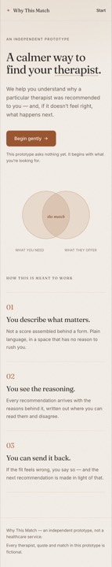

# Why This Match

> How can therapist matching be made more transparent without turning therapy into a
> therapist-shopping experience?

**Why This Match** is an independent portfolio prototype. The product it points towards would let
someone describe what they are looking for in their own words, have those preferences structured,
be matched with a therapist, **understand why that therapist was recommended**, say so when it does
not feel right, and receive a rematch based on that feedback.

This repository is **Phase 1 only**: the technical foundation and, more importantly, the visual
language of the product. No matching, no intake, no accounts, no data.

> **This is not a Mindbun product.** It is an independent prototype and is not affiliated with,
> endorsed by, or connected to Mindbun or any healthcare provider. No logos, illustrations, or
> marketing material have been reproduced. Every therapist, quote, and match that appears in this
> prototype is **synthetic** — invented for demonstration and not a real person.

| Landing                                               | Start                                             | Landing (mobile)                                               |
| ----------------------------------------------------- | ------------------------------------------------- | -------------------------------------------------------------- |
|  |  |  |

---

## Current phase

**Phase 1 — Foundation + visual design system.** Complete.

Shipped in this phase:

- npm-workspace monorepo: `apps/web` (React) and `apps/api` (Fastify).
- A complete, tokenised design system: warm palette, editorial type scale, spacing rhythm, radii,
  shadows, and motion — all in one stylesheet, all contrast-checked.
- Two designed routes (`/` and `/start`) plus a considered 404, responsive from 320px upward.
- Minimal Fastify service exposing `GET /health`.
- Tests, strict TypeScript, ESLint (type-aware + jsx-a11y), Prettier, and written documentation.

Deliberately **not** in this phase: intake questions, matching logic, explanation views, feedback,
persistence, authentication, and any third-party or AI service.

## Tech stack

| Layer    | Choice                                                                   |
| -------- | ------------------------------------------------------------------------ |
| Frontend | React 19, TypeScript, Vite 8, React Router 8, Tailwind CSS 4 (CSS-first) |
| Backend  | Node.js 24, TypeScript, Fastify 5                                        |
| Testing  | Vitest 5, Testing Library, `@testing-library/jest-dom`, Fastify `inject` |
| Tooling  | ESLint 9 (flat config, type-aware), Prettier 3, npm workspaces           |

No database, no ORM, no auth, no AI APIs, no Next.js, no Python — by design, per the phase brief.

## Requirements

- Node.js **>= 22.12** (developed on 24.7)
- npm 10+

## Getting started

```bash
npm install          # installs both workspaces
npm run dev          # web on http://localhost:5173, api on http://127.0.0.1:4000
```

`npm run dev` starts both apps together (via `concurrently`). To run them separately:

```bash
npm run dev:web      # Vite dev server, http://localhost:5173
npm run dev:api      # Fastify via tsx watch, http://127.0.0.1:4000
```

### Commands

| Command               | What it does                                      |
| --------------------- | ------------------------------------------------- |
| `npm run dev`         | Runs web and api together                         |
| `npm run dev:web`     | Web only                                          |
| `npm run dev:api`     | API only                                          |
| `npm run build`       | Type-checks and builds both workspaces            |
| `npm run preview:web` | Serves the production web build locally           |
| `npm test`            | Runs every test in both workspaces                |
| `npm run typecheck`   | `tsc --noEmit` for both workspaces                |
| `npm run lint`        | ESLint across the repo (`lint:fix` to autofix)    |
| `npm run format`      | Prettier write (`format:check` to verify)         |
| `npm run check`       | typecheck → lint → format:check → test, in one go |

### Verifying the API

```bash
curl http://127.0.0.1:4000/health
# {"status":"ok"}
```

## Configuration

Every value has a safe default, so `.env` is optional. Copy `.env.example` to `.env` at the repo
root to override anything:

| Variable        | Default       | Applies to | Purpose        |
| --------------- | ------------- | ---------- | -------------- |
| `NODE_ENV`      | `development` | api        | Runtime mode   |
| `API_HOST`      | `127.0.0.1`   | api        | Bind address   |
| `API_PORT`      | `4000`        | api        | Bind port      |
| `API_LOG_LEVEL` | `info`        | api        | Pino log level |

`.env` is git-ignored. Only `VITE_`-prefixed variables would ever reach the browser bundle, and
Phase 1 has none.

## Project structure

```
.
├── apps/
│   ├── api/                  Fastify service (health endpoint only)
│   │   ├── src/
│   │   │   ├── app.ts        buildApp(): unstarted instance + routes
│   │   │   ├── server.ts     process entry: config, listen, shutdown
│   │   │   ├── config/env.ts environment reading and validation
│   │   │   └── routes/       one module per endpoint, with its test
│   │   └── tsconfig.build.json
│   └── web/                  React client
│       ├── public/fonts/     self-hosted Fraunces + Inter (OFL 1.1)
│       └── src/
│           ├── app/          application bootstrap (App)
│           ├── components/   presentational building blocks
│           ├── layouts/      shared page frame (SiteLayout)
│           ├── lib/          tiny framework-free helpers
│           ├── pages/        one directory-free component per route
│           ├── routes/       route paths, route tree, browser router
│           ├── styles/       design tokens + base layer
│           └── test/         test setup and render helpers
├── docs/
│   ├── architecture.md       how Phase 1 is put together, and why
│   ├── design-system.md      the visual language
│   └── screenshots/
├── .env.example
└── package.json              npm workspaces root
```

## Documentation

- [`docs/design-system.md`](docs/design-system.md) — philosophy, tokens, components, motion,
  accessibility rules.
- [`docs/architecture.md`](docs/architecture.md) — structure, decisions, testing strategy, and the
  seams Phase 2 will plug into.

## Accessibility

Verified in a real browser, not assumed:

- Semantic landmarks (`header`/`main`/`footer`), one `h1` per route, ordered headings.
- Visible focus ring on every interactive element (2px clay outline, 3px offset), and a skip link
  as the first tab stop.
- Body and secondary text pass WCAG AA (4.5:1+); the accent action colour passes on `--color-surface`
  at 5.3:1.
- All decorative SVG is `aria-hidden`; the one meaningful diagram carries a screen-reader caption.
- `prefers-reduced-motion: reduce` removes every animation and transition.
- Layouts are designed at 320/390/834/1440px, not simply scaled down.

## Notes and licences

- Fonts: [Fraunces](https://fonts.google.com/specimen/Fraunces) and
  [Inter](https://fonts.google.com/specimen/Inter), both SIL Open Font License 1.1, self-hosted so
  the prototype makes no third-party requests.
- All copy, people, and matches are fictional.
- This prototype is not medical advice and not a healthcare service.
